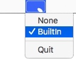

# mousepadspy
Use private MultiTouch framework to visualise trackpad/mousepad/magicmouse touches.

Supports 10.9 - 10.14

Menubar app

 - 

A proof of concept type thing to work out why my trackpad was behaving odd (i.e. water damage...)

[App Download](downloads/mousepadspy.app.zip)

